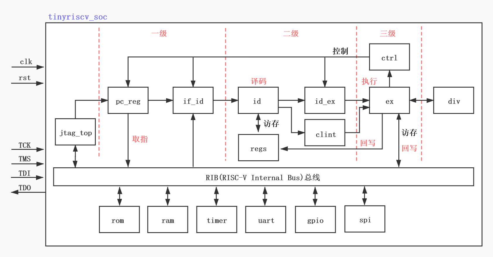

# riscv_soc_proj
本项目来源于github网站上liangkangnan的tinyriscv工程，主要是想利用此RISC-V核进行SOC芯片设计，学习如何在RISC-V上挂接一些外设或者IP核, 学习软硬件设计方法。   
代码链接: https://github.com/liangkangnan/tinyriscv  或者 https://gitee.com/liangkangnan/tinyriscv#only_comment_project

# RISC-V处理器
本项目RISC-V处理器采用的是一个单核32位的小型RISC-V处理器核(tinyriscv)，verilog语言编写，tinyriscv有以下特点：

1. 支持RV32IM指令集，通过RISC-V指令兼容性测试；
3. 采用三级流水线，即取指，译码，执行；
4. 可以运行C语言程序；
5. 支持JTAG，可以通过openocd读写内存(在线更新程序)；
6. 支持中断；
6. 支持总线；
7. 支持FreeRTOS；
8. 支持通过串口更新程序；
9. 容易移植到任何FPGA平台(如果资源足够的话)；

项目中的各目录说明：

**rtl**：该目录包含tinyriscv的所有verilog源码；

**sim**：该目录包含仿真批处理bat文件和脚本；

**tests**：该目录包含测试程序源码，其中example目录为C语言程序例程源码，isa目录为RV32指令测试源码；

**tools**：该目录包含编译汇编和C语言程序所需GNU工具链和将二进制文件转成仿真所需的mem格式文件的工具BinToMem，还有通过串口下载程序的脚本。BinToMem\_CLI.exe需要在cmd窗口下执行，BinToMem\_GUI.exe提供图形界面，双击即可运行；

**pic**：存放图片；

**tb**：该目录包含仿真的testbench文件；

**fpga**：存放FPGA相关文件，比如约束文件；

tinyriscv的整体框架如下：

tinyriscv目前外挂了6个外设，每个外设的空间大小为256MB，地址空间分配如下图所示：

改进点：将timer0模块的地址进行了细分，可以方便添加更多的模块。
地址：0x2000_0000~0x2FFF_FFFF    
分成了256个区域：由地址的第20位到第27位来区分；
每个区域最大可支持1024个模块，每个模块最多可支持256个寄存器配置；

# project中可以改进的点    
1. 地址分配不好，不利于扩展，限制了可增加模块的数量，而且也造成了空间的浪费；   
2. 每个外设模块尽可能做一个Clock gating的操作，增加功耗的控制开关，在不开时尽可能节省功耗；    
3. 

